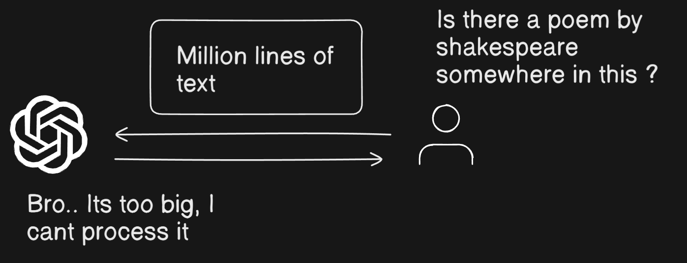
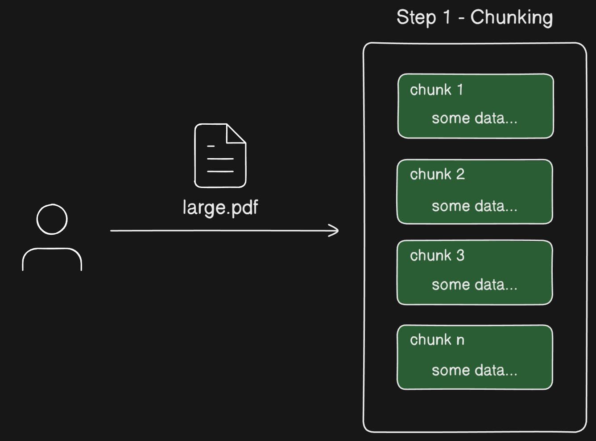
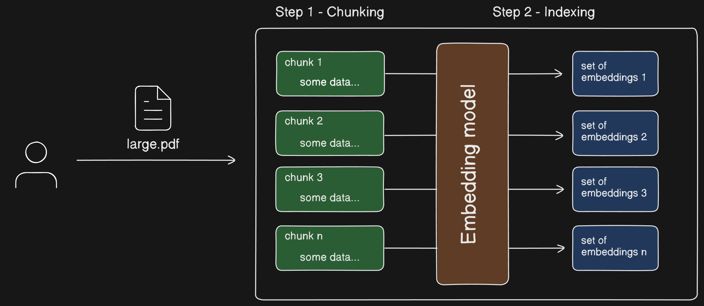
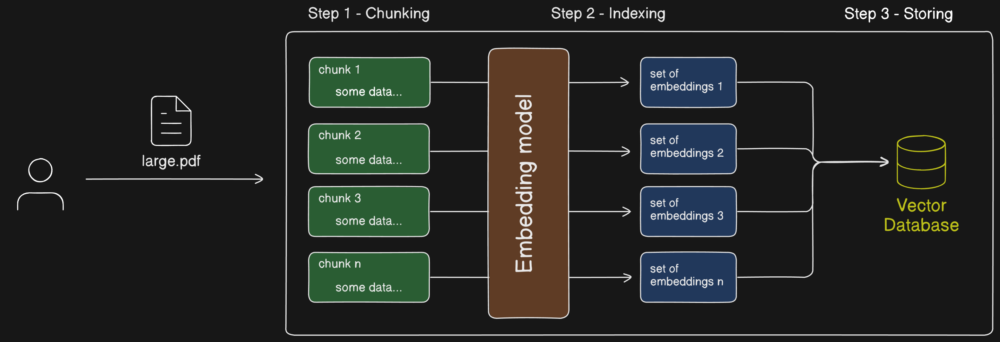
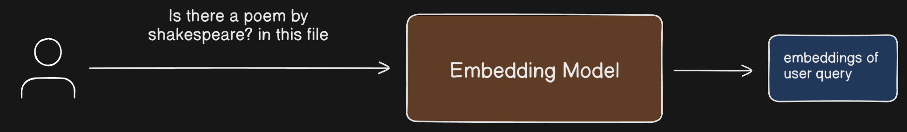
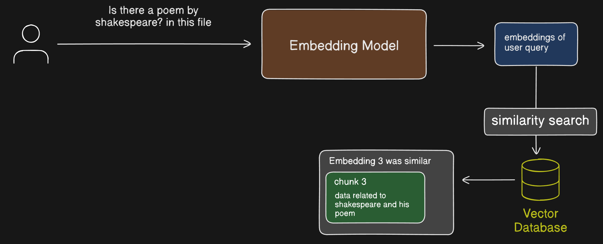
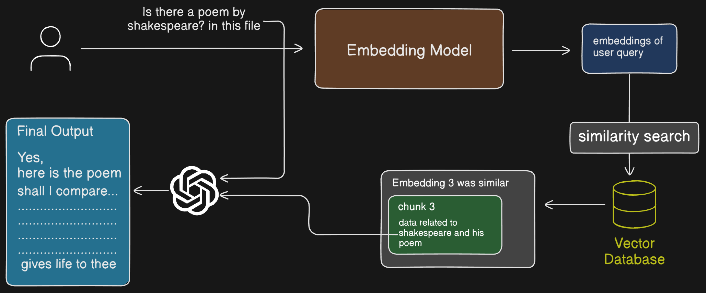

# What is RAG ?

LLMs are great at answering questions because they have been trained on a lot of data. But how can we train them on our personal data? Personal data could be an organization's internal knowledge base or all the articles and blogs you have written. Injecting this personal data into Large Language Models (LLMs) and then getting answers back is what we can call RAG in the simplest terms.

# Why RAG ?

> Can't we just paste our personal data into the prompt if we need answers about our data?

Yes, you could, and that's an efficient method when your data is small and fits within the context window. (The context window refers to the maximum size of a prompt that can be sent.)

However, PDFs are often around 50-100 pages with lots of text. Can you paste all of that into the prompt? That would be very inefficient.

> But I always got an answer when I uploaded a really big document. How did that happen?

Yes, uploading a document works because it uses RAG behind the scenes. However, pasting the contents directly into the prompt would be inefficient.

# How does RAG work ?

Lets now understand how RAG works step by step

## Step 1 - Chunking

> Chunking refers to the process of splitting large amounts of data into smaller portions

How to chunk a document is a complex process. There isn't a universal size for a chunk. It's up to the developers to experiment with different methods to determine how they should chunk the data.

## Step 2 - Indexing

> Indexing is the process of storing this chunks in a way that allows us to retrieve them efficiently

Suppose you wanted to know if a big PDF contained a poem written by Shakespeare. Let's assume that the poem and author details are stored in a specific chunk. If we could retrieve just that chunk, we could easily answer your query by providing the data from that chunk to the LLM. Of course, it would then confirm it.

Indexing achieves this by first converting all the chunks into vector embeddings and then storing them in a vector database.

> **Vector embeddings** turn things like text or images into numbers, so that similar things are close together on a graph. For example, the words _king_ and _queen_ will be close in this space because they have similar meanings. This helps computers understand relationships between words, images, or other data.

How do we convert them into vector embeddings?

Many AI companies that own an LLM have their own vector embeddings. We can use any of these to convert the data into vector embeddings. Some are proprietary, like OpenAI, while others are open source, such as those from [Hugging Face](https://huggingface.co/sentence-transformers).

## Step 3 - Storing

We now need to store these sets of embeddings in a database. It's important to note that we can't just use our regular No-SQL or SQL databases. We need a different type of database that is efficient at storing these embeddings, allowing us to perform similarity searches and other operations.

> A database that stores vectors and allows us to perform related operations is called a **Vector Database**

Here is a list of popular Vector databases

- Pinecone
- Qdrant
- pgvector
- Milvas

## Step 4 - Embedding of User query

A user always has a question or wants information from this document. To find the relevant parts, we need to perform a similarity search. Therefore, we first need to convert the user's query into embeddings.

> Note: We will need to use the same embedding model

## Step 5 - Retrieval of relevant chunks

Once the user's query is converted into embeddings, we perform a similarity search using these embeddings. This returns embeddings along with data that contains similar information.

## Step 5 - Passing the retrieved data and the original user query to LLM.

Now we have the relevant chunk, which hopefully contains a poem by Shakespeare and his name. We will send this data as context to the LLM, along with the original user query. The LLM should then respond by confirming and displaying the poem.

And that’s how a simple Retrieval-Augmented Generation (RAG) system operates behind the scenes. By now, you should have a solid understanding of the fundamental components and processes involved in constructing a basic RAG-based application. This includes everything from embedding user queries to performing similarity searches and leveraging vector databases to retrieve relevant information. In my next article, we will dive deeper into this topic and work together to build a practical RAG application step by step. This hands-on approach will help solidify your understanding and give you the confidence to implement RAG systems in real-world scenarios.

## Thankyou,

### My Socials

- X - [https://x.com/06_Shreehari](https://x.com/06_Shreehari)
- LinkedIn - [https://www.linkedin.com/in/shreehari-acharya/](https://www.linkedin.com/in/shreehari-acharya/)
- GitHub - [https://github.com/Shreehari-Acharya](https://github.com/Shreehari-Acharya)
