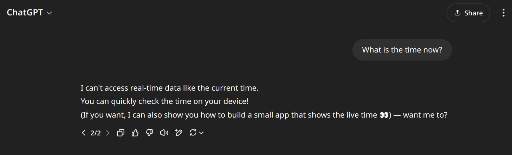
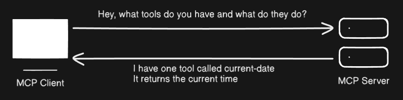
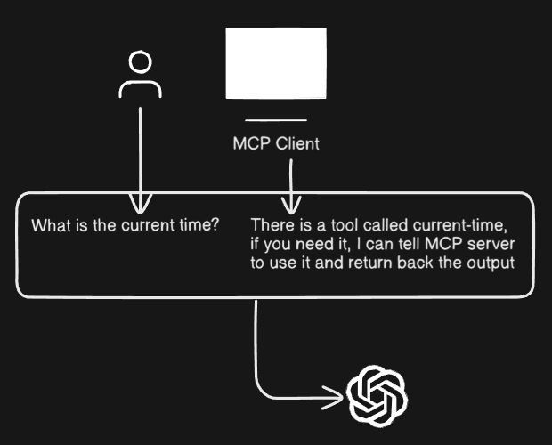
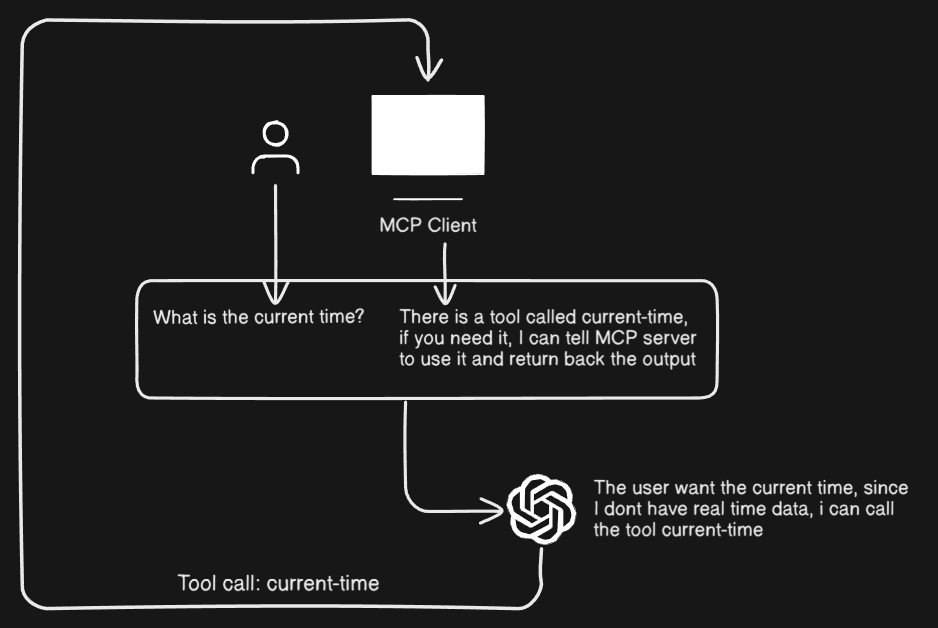
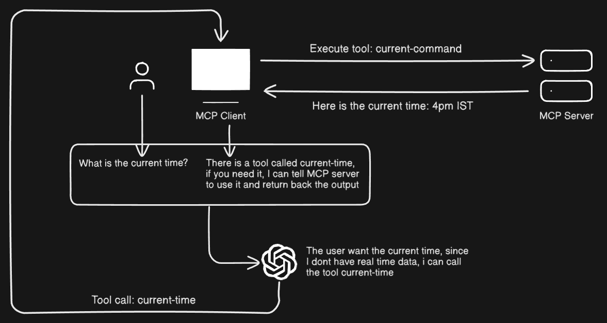
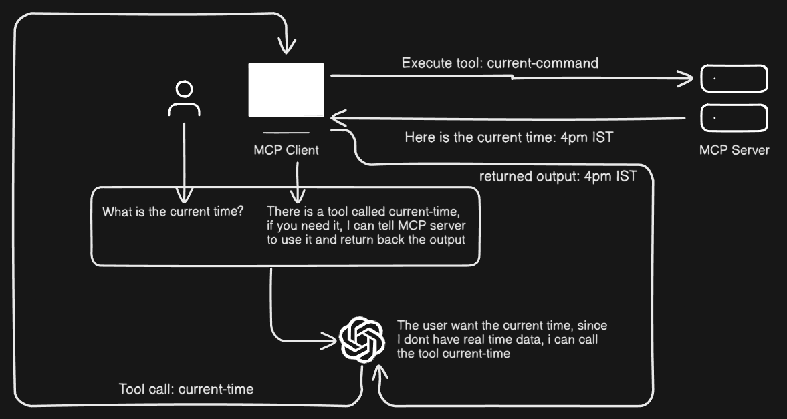
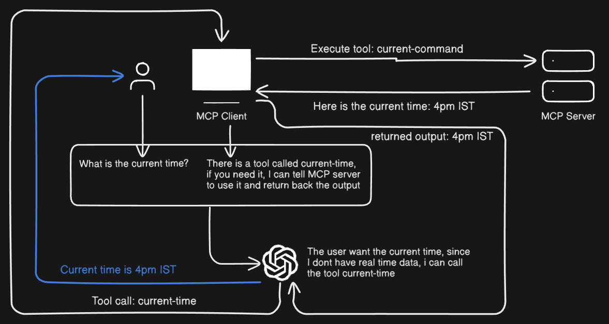

## Lets start by breaking down each word

**Model** : Its referring to the Large Language Model (LLM)

**Context** : Explaining what and how, which is required for the model to produce great answers

**Protocol** : Just a set of rule on how to do something.

> So MCP is a set of rules that tells the Large language model **what** and **how** to use certain tools.

## Understanding a Tool

When we write a program, we create functions, and then need to **call the function** explicitly to run it.

```python
from datetime import date

def get_current_date(): # A simple function that returns the current date
    return date.today()

if __name__ == "__main__":
    print("Today's date is:", get_current_date()) # calling the function
```

### What happens, when we ask the current date/time to chatGPT?



See.. It could not give us the current time because it does not have access to real-time data. But our small program does have a function which can give me the date.

> What if we could somehow give chatGPT the ability to run our custom function?

That is what a Tool is! Its just another name for a particular function

## MCP Client & MCP Server

Let us now understand the difference between MCP Client and MCP Server

### MCP Client

The browser knows how to interact with a web-server. It knows the HTTP and thus can talk to any web server. Similarly a MCP Client knows how to talk to a MCP Server. Some of the popular applications have MCP Client. Cluade desktop, Cursor, Windsurf are among the popular ones.

### MCP Server

The MCP server contains these Tools which LLM can call to execute certain actions. It also describes the tool purpose, how it is used, what parameters does it take, and what does it return on successful execution.

## Final flow

Let's suppose we have an MCP Server with just one tool called current-date, which calls our defined function `get_current_date()`.

The first step is to communicate with the MCP Server to get all the tools, their description, the parameters they take, and what they return upon successful execution. We do this using the MCP **Client.** The next step is to take the user's query and pass it along with the list of tools and their descriptions. Now, the LLM can call the tools if it needs specific information that a tool can provide, using the MCP Client to access real-time data!

## Diagram explaining the entire process

### Step 1



### step 2



### Step 3



### Step 4



### Step 5



### Final step: ChatGPT gives back the final output to the user



## Where can it be useful?

It can be used in a lot of places. You could have a MCP-server hosting your tools, which may be functions to post something on social media, or send an email, or whatever you can imagine. Then just ask the AI which has access to your MCP server to do some task, and if needed it will call the tool and can even post a tweet on behalf of you!.

### Larger use cases

Many companies have already started building their own MCP servers, so that their users can interact with their products directly in human language. Here is a list of such amazing servers, that can perform some amazing tasks. [MCP-servers-list](https://github.com/modelcontextprotocol/servers)

## Further materials

Official documentation - [https://modelcontextprotocol.io/introduction](https://modelcontextprotocol.io/introduction)

creating a MCP server to buy/sell stocks - [https://youtu.be/1iJ34tTjwwo?si=7asblcnGFztWK7ou](https://youtu.be/1iJ34tTjwwo?si=7asblcnGFztWK7ou)

## Thank you,

X - [https://x.com/06_Shreehari](https://x.com/06_Shreehari)

LinkedIn - [https://www.linkedin.com/in/shreehari-acharya/](https://www.linkedin.com/in/shreehari-acharya/)

GitHub - [https://github.com/Shreehari-Acharya](https://github.com/Shreehari-Acharya)
